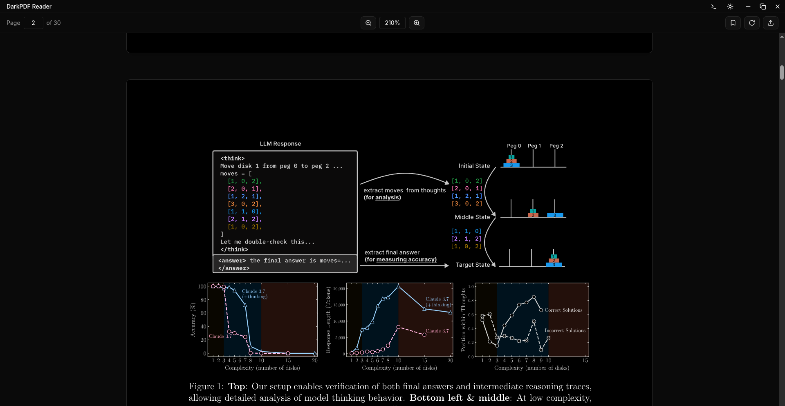

# DarkPDF Reader




DarkPDF Reader is a PDF viewer built with Electron, React, and Vite. It was originally created for personal use, especially for late-night studying. It features dark mode for both the UI and the PDF itself, smooth scrolling, zoom, and page navigation.

While it was primarily built and tested for Linux, it should work on Windows and macOS as well.

## Features
- Dark mode UI which also inverts the PDF colors
- Light mode also available
- Zoom in/out, rotate, and jump to any page
- Text-selection and copying (might break at some zoom levels)

## Technologies Used
Electron Forge, Vite, React, Typescript, Shadcn UI, Tailwind CSS, Pdfjs

## Development usage
1. Install dependencies:
   ```sh
   npm install
   ```
2. Start the app in dev mode:
   ```sh
   npm start
   ```
3. Build distributables:
   ```sh
   npm run make
   ```

## License
MIT
